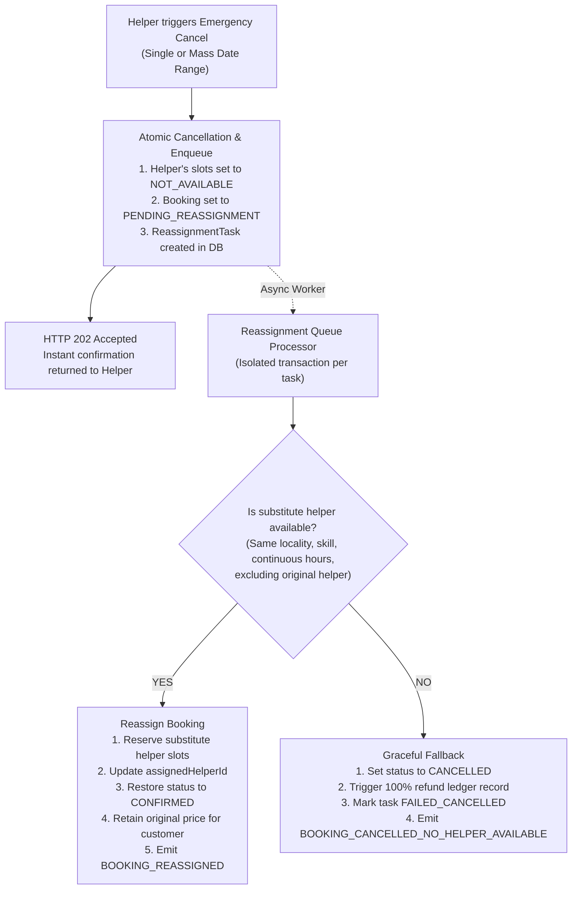

# Database Core Entities Specification

This document reflects the entities currently implemented under `com.househelper.model` and persisted with Spring Data JPA in the H2 database.

## Entity relationships

```text
Customer (1) ──< Booking (N)
Customer (1) ──< BookingSeries (N) ──< Booking (N)
Customer (1) ──< CustomerReview (N)
Helper   (1) ──< HelperAvailability (N)
Booking          ──< ReassignmentTask (1)
Booking / BookingSeries ──> Payment records (linked by IDs)
Booking / BookingSeries / Helper workflows ──> SystemEvent audit records
```

Bookings reference a customer through a required JPA `ManyToOne` relationship and may reference a booking series. A series belongs to a customer and groups occurrences scheduled on its selected weekdays. The assigned helper is stored as `assignedHelperId`. Availability references a helper through `ManyToOne`. Payment and audit event associations are represented by IDs/aggregate fields rather than JPA entity relationships.

## `Customer`

| Field | Type | Persistence / validation |
| --- | --- | --- |
| `id` | `UUID` | Generated UUID primary key. |
| `name` | `String` | Required, non-blank. |
| `address` | `String` | Required, non-blank; column length 1000. |
| `phone` | `String` | Optional contact phone, max length 20. |
| `email` | `String` | Optional contact email with format validation. |
| `totalRating` | `BigDecimal` | Cumulative submitted rating total by helpers, defaults to `0`. |
| `ratingCount` | `Long` | Number of submitted ratings by helpers, defaults to `0`. |

Customers are managed through `CustomerResource` (`/api/customers`). Deletion is rejected when the customer has booking history. Average rating is computed via `getRating()` (`totalRating / ratingCount`).

## `CustomerReview`

| Field | Type | Persistence / validation |
| --- | --- | --- |
| `id` | `UUID` | Generated UUID primary key. |
| `customer` | `Customer` | Required `ManyToOne` relationship to the reviewed customer. |
| `helperId` | `UUID` | Required UUID of the assigned helper who served the customer. |
| `bookingId` | `UUID` | Required UUID with unique constraint (`uk_customer_review_booking`). |
| `rating` | `Integer` | Required integer between 1 and 5. |
| `review` | `String` | Optional review commentary, max length 1000. |
| `createdAt` | `Instant` | Required timestamp set at creation. |

Indexes:
- `idx_review_customer_created` on `(customer_id, created_at)`
- `idx_review_helper_id` on `helper_id`

Reviews can only be submitted after service delivery has concluded (the associated booking status must be `COMPLETED`). Updates to customer rating aggregations use pessimistic write locking (`findByIdForUpdate`) to guarantee consistency under concurrency.

## `Helper`

| Field | Type | Persistence / validation |
| --- | --- | --- |
| `id` | `UUID` | Generated UUID primary key. |
| `name` | `String` | Required, non-blank. |
| `phone` | `String` | Required and unique (`uk_helper_phone`). |
| `gender` | `Gender` | Required; persisted as an enum string (`FEMALE`, `MALE`, or `OTHER`). |
| `localities` | `Set<String>` | JPA element collection with `@BatchSize(size = 30)`. |
| `skills` | `Set<SkillType>` | JPA element collection with `@BatchSize(size = 30)`. |
| `hourlyRate` | `Double` | Required and positive. |
| `totalRating` | `BigDecimal` | Required; cumulative submitted rating total, defaults to `0`. |
| `ratingCount` | `Long` | Required; number of submitted ratings, defaults to `0`. |
| `governmentIdProof` | `String` | Persisted using `EncryptedStringConverter` with AES-GCM. |

`SkillType` values: `CLEANING`, `COOKING`, `CHILD_CARE`, `ELDER_CARE`, `LAUNDRY`, `DISH_WASHING`, `OTHER`.
The helper's average rating is calculated from `totalRating / ratingCount` (or `0` when there are no ratings). `POST /api/helpers/{helperId}/ratings` adds an integer rating from 1 to 5; a pessimistic row lock prevents concurrent submissions from losing updates. Helper search requires locality, skill, and an exact available date/time slot. Gender, maximum hourly rate, and minimum rating are optional filters.

The encryption key is read from `HOUSEHELPER_ENCRYPTION_KEY`, with a development-only fallback in `application.yml`. The same key must be retained to decrypt existing values; production must use a securely managed key.

## `HelperAvailability`

| Field | Type | Persistence / validation |
| --- | --- | --- |
| `id` | `UUID` | Generated UUID primary key. |
| `helper` | `Helper` | Required `ManyToOne`. |
| `slotDate` | `LocalDate` | Required. |
| `startTime` | `LocalTime` | Required. |
| `endTime` | `LocalTime` | Required. |
| `status` | `AvailabilityStatus` | Required enum string: `AVAILABLE`, `BOOKED`, or `NOT_AVAILABLE`. |
| `version` | `Long` | JPA `@Version` optimistic locking field. |

Indexes:
- `idx_availability_slot` on `(slot_date, start_time, status)`
- Unique constraint `uk_helper_availability_start` on `(helper_id, slot_date, start_time)`

The combination of helper, date, and start time is unique. Availability accepts fixed one-hour slots starting on the hour, which prevents overlap between newly submitted slots. Booking candidate queries use `findSlotsInWindow` for single-query multi-hour retrieval. When a helper reports emergency cancellation, their affected availability slots are automatically updated to `NOT_AVAILABLE`.

## `Booking`

| Field | Type | Persistence / validation |
| --- | --- | --- |
| `id` | `UUID` | Generated UUID primary key. |
| `customer` | `Customer` | Required `ManyToOne`, stored as `customer_id` foreign key. |
| `bookingSeries` | `BookingSeries` | Optional `ManyToOne`, stored as `booking_series_id`; null for one-off bookings. |
| `assignedHelperId` | `UUID` | Required helper ID. |
| `locality` | `String` | Required, non-blank. |
| `skill` | `SkillType` | Required enum string. |
| `bookingDate` | `LocalDate` | Required. |
| `startTime`, `endTime` | `LocalTime` | Required (whole-hour duration on the hour). |
| `totalAmount` | `Double` | Required; non-negative. |
| `status` | `BookingStatus` | Required enum string. |
| `bookingType` | `BookingType` | Required enum string: `INSTANT`, `SCHEDULED`, or `RECURRING`. |
| `version` | `Long` | JPA `@Version` optimistic locking field. |

Indexes:
- `idx_booking_customer_id` on `customer_id`
- `idx_booking_helper_date` on `(assigned_helper_id, booking_date)`
- `idx_booking_series_id` on `booking_series_id`

`BookingStatus` values: `PENDING_PAYMENT`, `CONFIRMED`, `CANCELLED`, `RESCHEDULED`, `COMPLETED`, `PENDING_REASSIGNMENT`.
- `COMPLETED`: Service was delivered successfully; unlocks maid review submission for the customer.
- `PENDING_REASSIGNMENT`: Helper initiated an emergency cancellation; booking is currently in the reassignment queue to find a replacement maid.

## `ReassignmentTask`

| Field | Type | Persistence / validation |
| --- | --- | --- |
| `id` | `UUID` | Generated UUID primary key. |
| `bookingId` | `UUID` | Required UUID of the impacted booking. |
| `originalHelperId` | `UUID` | Required UUID of the cancelling helper. |
| `reassignedHelperId`| `UUID` | Nullable UUID of the substitute helper once reassigned. |
| `reason` | `String` | Optional emergency reason, max length 1000. |
| `status` | `ReassignmentTaskStatus` | Enum: `PENDING`, `REASSIGNED`, or `FAILED_CANCELLED`. |
| `attempts` | `Integer` | Number of processing attempts, defaults to 0. |
| `failureReason` | `String` | Nullable failure explanation if no substitute was found. |
| `createdAt` | `Instant` | Required timestamp set at creation. |
| `updatedAt` | `Instant` | Nullable timestamp set upon processing completion. |

Indexes:
- `idx_reassignment_status_created` on `(status, created_at)`
- `idx_reassignment_booking_id` on `booking_id`
- `idx_reassignment_original_helper` on `original_helper_id`

## `Payment`

| Field | Type | Persistence / validation |
| --- | --- | --- |
| `id` | `UUID` | Generated UUID primary key. |
| `bookingId` | `UUID` | Optional booking ID; null for a series-level consolidated refund. |
| `bookingSeriesId` | `UUID` | Optional series ID for tracing payments. |
| `providerReference` | `String` | Optional reference returned by the payment processor. |
| `paymentType` | `PaymentType` | Required enum string: `BOOKING_PAYMENT`, `RESCHEDULE_PAYMENT`, `CANCEL_REFUND`, or `RESCHEDULE_REFUND`. |
| `relatedPaymentId` | `UUID` | Optional ID of original charge. |
| `amount` | `Double` | Required; non-negative. |
| `paymentMethod` | `PaymentMethod` | Required enum string: `CARD`, `UPI`, or `WALLET`. |
| `paymentStatus` | `PaymentStatus` | Required enum string. |
| `version` | `Long` | JPA `@Version` field. |

Indexes:
- `idx_payment_booking_id` on `booking_id`
- `idx_payment_series_id` on `booking_series_id`

## Database Indexing & Query Optimization Strategy

1. **Secondary B-Tree Indexes on Foreign Keys**:
   Explicit indexes added to `bookings(customer_id)`, `bookings(assigned_helper_id, booking_date)`, `bookings(booking_series_id)`, `payments(booking_id)`, and `payments(booking_series_id)` eliminate full table scans on high-traffic read paths (customer history, series refund queries, helper schedule checks).
2. **N+1 Prevention via `@BatchSize`**:
   `Helper.localities` and `Helper.skills` use `@BatchSize(size = 30)` to load collection elements in single SQL batch queries during paginated helper searches instead of issuing $2N$ separate roundtrips.
3. **Cartesian Product Elimination via `DISTINCT`**:
   `findAvailableHelpersForSlot` and `findAvailableSlotsFrom` enforce `SELECT DISTINCT availability` to prevent duplicate row entries when querying across joined collection element tables.
4. **Single-Query Window Lookups**:
   Multi-hour slot lookups and slot releases utilize `findSlotsInWindow` with batch operations (`saveAll`), replacing iterative while-loop queries.

---

## Helper Emergency Cancellation & Graceful Reassignment Architecture

### Why This Feature Exists
House helpers encounter genuine emergencies (medical illness, accidents, urgent personal crises). In a gig platform:
1. Helpers need a simple mechanism to instantly report an emergency (single booking or mass date range) without penalizing their account or leaving them trapped on calls.
2. Customers should **not** suffer service disruption. Rather than immediately cancelling bookings, the platform attempts automated reassignment to qualified substitute helpers in the same locality.
3. If no substitute is available, the platform **gracefully degrades** by auto-cancelling the booking and immediately issuing a 100% full refund without requiring manual customer support tickets.

### How It Works Gracefully (Option B: Asynchronous Queue Pattern)



#### Key Guarantees:
1. **Immediate Non-blocking Helper UX**: The helper receives `202 Accepted` immediately; their upcoming schedule is cleared, and slots are marked `NOT_AVAILABLE` so they cannot be re-booked during leave.
2. **Customer Price Protection**: If a substitute helper charges a higher hourly rate, the customer's total price remains protected at the original agreed rate.
3. **Queue Resilience & Observability**:
   - Every task is persisted in the `reassignment_tasks` database table.
   - Operations teams can inspect the queue at `GET /api/reassignments/tasks`.
   - Reassignment checks can be rerun on demand via `POST /api/reassignments/process`.
